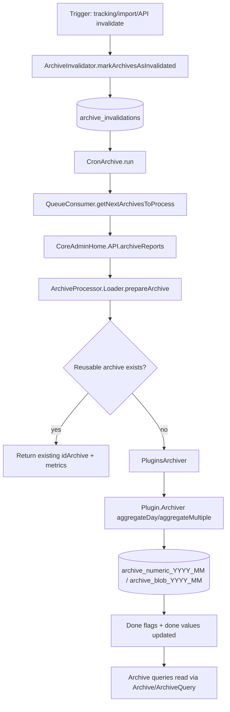

# Archiving Flow

## What this covers

End-to-end archiving pipeline from invalidation to stored archive rows.

## Key takeaways

- Invalidation and processing are decoupled by `archive_invalidations`.
- Reuse checks happen before expensive aggregation work.
- Segment-aware done flags and scheduling affect both correctness and throughput.
- Plugin `RecordBuilder`s are invoked inside `Plugin\Archiver` for both day and non-day paths.

## Diagram

## Evidence

- `core/Archive/ArchiveInvalidator.php`: invalidation and queue semantics.
- `core/CronArchive.php`: orchestrates run and queue consumer.
- `core/CronArchive/QueueConsumer.php`: batch/segment/period scheduling constraints.
- `plugins/CoreAdminHome/API.php`: `archiveReports` calls `Loader`.
- `core/ArchiveProcessor/Loader.php`: reuse, lock, aggregate path.
- `core/ArchiveProcessor/PluginsArchiver.php`: plugin aggregation execution.
- `core/Plugin/Archiver.php`: plugin archiver contracts.
- `core/Db/Schema/Mysql.php`: archive and invalidation table schemas.
- https://developer.matomo.org/guides/archiving
- https://developer.matomo.org/guides/archiving-behavior-specification
- https://developer.matomo.org/guides/archive-data

## Open questions / next investigations

- Add a sequence diagram for plugin-only invalidation (`name = done<hash>.<plugin>` path).
